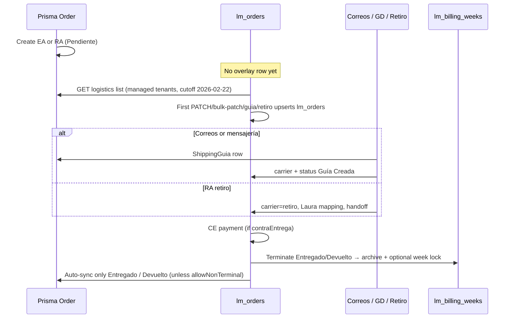

# Order ↔ logistics flow

Customer fields live on Prisma `Order`. Logistics metadata lives on `lm_orders` joined by `crm_order_id = Order.id`.

## 1. CRM creation (any tenant)

Sources: `src/app/api/orders/route.ts`, `src/app/ventas/components/EnhancedSalesForm.tsx`, `src/lib/validation.ts`, bot `src/lib/bot/ai-tools.ts`, integration API.

- **EA** (envío): address + shipping method required.
- **RA** (retiro): pickup; no shipping cost. Fewest fields — use this for Cloud smoke tests (`AGENTS.md`).
- Default status `Pendiente`. Display `orderId` typically `ORDER-<timestamp>`.
- Default Kanban keys (`src/lib/default-statuses.ts`): Pendiente → En Proceso → Urgente → Completado → Enviado → Entregado. Tenants customize in Config. Logistics may add **Devuelto**.
- Inventory may decrement on CRM order create. That is **tenant inventory**, not Laura `lm_retiro_stock`.
- Bot/webhooks can create the same Prisma row.

No `lm_orders` row is created here.

## 2. Logistics visibility

`GET /api/logistics/orders` (`src/app/api/logistics/orders/route.ts`):

- Prisma `Order` filtered to `MANAGED_TENANT_IDS`
- Default timestamp cutoff **2026-02-22**
- Left join `lm_orders`, `ShippingGuia`, latest `lm_ce_payments`
- Unmanaged `crm_tenant_id` on write → 403

## 3. Overlay upsert

First logistics mutation creates `lm_orders`:

- `PATCH /api/logistics/orders` or `bulk-patch`
- Bulk guía generation (`src/app/api/logistics/guias/generate-bulk/route.ts`)
- Bot guía helper `src/lib/bot/guia-service.ts` (carrier `correos`, status `Guía Creada`)
- Retiro / private-delivery flows

`lm_orders.carrier`: `mensajeria` | `correos` | `retiro` | `null` (unassigned board). This is **not** the same field as CRM `orderType`. An RA order can still sit unassigned until someone sets `carrier: 'retiro'`.

## 4. Carriers and guías

**Correos:** SOAP in `src/lib/correos/`. Logistics credentials from `lm_carrier_configs` (`correos_ws_*`). Persist Prisma `ShippingGuia` (`carrier: 'correos_cr'`) + LM status `Guía Creada`. Per-order cost `correos_shipping_cost`.

**Mensajería / GD:** board statuses + `/logistics/mensajeria-privada` + `lm_private_delivery_confirmations`. Rates in `src/lib/logistics-rates.ts`.

**Retiro:** `/logistics/retiros`. Locations in `src/lib/retiro-locations.ts`:

| Location | Inventory |
|----------|-----------|
| `laura_escazu` | Deducts `lm_retiro_stock` (`agent_key = 'laura'`). Confirm blocked until mapped qty covers the order. |
| `marlenn_desamparados` | Handoff only. No stock deduction. |

Laura mapping: aliases (`POST /api/logistics/retiros/aliases`) + per-unit allocations (`lm_retiro_order_allocations`, `RetiroProductMapper`). Generic labels (e.g. Parche) must not seed a global alias so mixed orders stay independently mappable. Fuzzy match is unique-only.

Confirm: `src/app/api/logistics/retiros/confirm/route.ts` → handoff + optional stock + sync CRM `Entregado`.

## 5. Contra entrega

Prisma: `Order.contraEntrega`, `Order.cePaymentConfirmed`.  
Logistics: `POST /api/logistics/contra-entrega` → `lm_ce_payments` + flags on both rows.

Entregado is blocked until CE is collected when the order is COD. Tenant production UI can also confirm payment (`/api/orders/confirm-payment`) — keep both paths consistent.

## 6. Status sync back to CRM

Source: `src/lib/logistics-crm-sync.ts`.

| LM status (normalized) | CRM status | Auto-sync? |
|------------------------|------------|------------|
| pendiente | Pendiente | no (unless `allowNonTerminal`) |
| en proceso | En Proceso | no |
| guia creada / impreso / en transito | Enviado | no |
| entregado | Entregado | **yes** |
| devuelto | Devuelto | **yes** |

`return-to-pending` uses `allowNonTerminal: true`. Manual sync endpoint: `/api/logistics/sync-crm-status`. Carriers UI can call sync per order.

CRM remains authoritative for customer fields; do not overwrite product/address from LM.

## 7. Terminate, archive, billing weeks

`POST /api/logistics/orders/terminate`:

- Requires CE collected before Entregado
- Sets `archived_at`, `completed_at` / `completed_by`
- May attach Correos costs
- Syncs terminal CRM statuses
- Optional finalize into `lm_billing_weeks` (`billed_week_id`, `billed_at`)

Revert: `/api/logistics/billing-weeks/revert`.  
Return to pending: `/api/logistics/orders/return-to-pending`.

## 8. Accounting, payroll, finance reads

- Accounting UI rolls shipping/handling/CE per managed tenant.
- Payroll = closed non-voided `lm_time_entries` × `hourly_rate_crc` (global, not brand-split). Finance `GET /api/finance/v1/payroll` must not be double-counted per brand.
- Finance orders/costs join Prisma `Order` ↔ `lm_orders` for **finance tenants only**. Date = `COALESCE(lm.completed_at, Order.timestamp)` in `America/Costa_Rica` (`src/lib/finance-dates.ts`).
- DeepSleep product/source classifier: `src/lib/finance-order-classifier.ts` (version `1.1.0`). Bloom / DeepClean / Forge are 1:1 tenant=business.

## Authority at each step

| Step | Authoritative record |
|------|----------------------|
| Customer, products, address, CRM status (non-terminal) | Prisma `Order` |
| Carrier, LM kanban, archive, billed week | `lm_orders` |
| Tenant guía PDF/SOAP id | Prisma `ShippingGuia` |
| CE collection (ops) | `lm_ce_payments` + flags on both |
| Laura on-hand qty | `lm_retiro_stock` |
| SaaS subscription | `Tenant` + Tilopay |
| Worker time | `lm_time_entries` |

## What not to do

- Do not create `lm_orders` for unmanaged tenants.
- Do not treat finance brand slugs as logistics tenant filters.
- Do not deduct Laura stock for Marlenn.
- Do not `prisma db push` to “add a column” for logistics.
- Do not assume a CRM status change updates `lm_orders` — sync is LM → CRM for terminals, not a two-way live replica.
