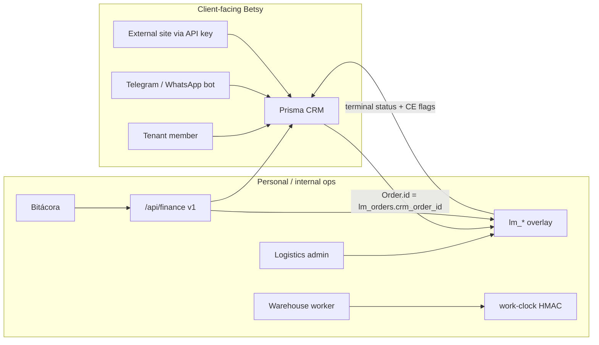

# System boundaries

This repository is **not** a monorepo. One Next.js 15 App Router process serves marketing, tenant CRM, internal logistics, workforce clock, finance read-API, bots, and cron.

## Surface A — Betsy CRM (SaaS)

Multi-tenant order/production CRM for paying customers (Costa Rica / Central America).

| Owns | Does not own |
|------|----------------|
| Tenant-scoped Prisma data (`Order`, `Client`, `InventoryItem`, config catalogs, invoices, Tilopay billing) | `lm_*` tables, workforce punches, Laura stock |
| `/ventas`, `/produccion`, `/estadisticas`, `/config`, `/dashboard` | `/logistics/**`, `/work-clock` |
| Tenant shipping guías in Prisma `ShippingGuia` | Logistics carrier boards, bulk Correos from LM credentials |
| SaaS subscription (Tilopay) | Internal billing weeks / CE collections / payroll |

Entry differentiation: talking to Grok on Telegram/WhatsApp with a tenant `botAccessCode`.

## Surface B — HolaMA Logistics (internal)

Owner-operated fulfillment overlay for **Betsy's own brands**, not a feature every SaaS tenant gets.

| Owns | Does not own |
|------|----------------|
| Carrier assignment, guias, retiros, CE collection, billing weeks, workforce, admin P&L | Tenant membership, SaaS plans, bot access codes |
| `lm_*` schema via `supabase/migrations/` + some runtime `CREATE TABLE` | Prisma schema changes for CRM models |
| Allowlisted managed tenants only | Arbitrary SaaS tenants |

UI brand: **HolaMA · Logistics Manager** in `src/app/logistics/layout.tsx`.

Workers punch on `/work-clock` with an HMAC employee code — no NextAuth.

## Shared infrastructure (neither “product”)

| Piece | Path | Notes |
|-------|------|--------|
| NextAuth / middleware | `src/lib/auth-options.ts`, `src/middleware.ts` | Strips spoofable `x-user-*` / `x-tenant-id`, re-injects after JWT |
| Tenant Prisma helper | `src/lib/prisma-tenant.ts`, `src/lib/tenantContext.ts` | Auto-scope listed models |
| Backups | `src/lib/backups/` | Vercel Blob dumps of **all** `public` tables including `lm_*` |
| Safe db push | `scripts/safe-db-push.mjs` | Refuses Supabase / any DB with `lm_%` |
| Super-admin | `/super-admin`, `src/lib/super-admin-helpers.ts` | Cross-tenant monitoring; break-glass |

## Directory ownership

| Tree | Surface |
|------|---------|
| `src/app/ventas`, `produccion`, `estadisticas`, `config`, `dashboard`, `exports`, `setup-wizard` | CRM |
| `src/app/api/orders`, `sales`, `config`, `estadisticas`, `billing`, `tilopay`, `invoices`, `bot`, `shipping` | CRM |
| `src/app/logistics`, `src/app/api/logistics` | Logistics |
| `src/app/work-clock`, `src/app/api/work-clock` | Workforce (logistics) |
| `src/app/api/finance`, `src/lib/finance-*.ts` | Internal finance API (Bitácora) |
| `src/lib/logistics-*.ts`, `retiro-*.ts`, `workforce-*.ts`, `correos/` | Logistics-heavy (Correos also used by tenant guía UX / bot) |
| `prisma/` | CRM only |
| `supabase/migrations/` | Logistics `lm_*` only |
| `src/lib/backups/` | Shared DR |

## Tenant sets (not synonyms)

| Set | Source | Members (as of this KB) |
|-----|--------|-------------------------|
| All SaaS tenants | Prisma `Tenant` | Any registered org |
| Logistics-managed | `src/lib/logistics-managed-tenants.ts` | WhatASheet CR, DeepSleep, WAS CR, Kroma Lab, SimplePatch, DeepCLean, PeterTesting, Bloom, Forge |
| Finance API brands | `src/lib/finance-tenants.ts` | DeepSleep, Bloom, DeepClean, Forge **only** |
| RA pickup agents | `src/lib/retiro-locations.ts` | `laura_escazu`, `marlenn_desamparados` — **not** tenants |

Do not add a tenant to logistics or finance allowlists without an explicit human request. Seed SQL in `supabase/migrations/002_logistics_manager.sql` is **stale** vs code (missing Bloom/Forge). **Runtime code is authoritative.**

## Overlap edges (easy to get wrong)

1. **CRM `Order` is the customer-data source of truth.** Logistics stores overlay fields (carrier, LM status, billed week, archive). Do not fork customer/address/product into `lm_orders`.
2. **Two guía paths.** Tenant production/bot may write Prisma `ShippingGuia`. Logistics bulk guias also write `ShippingGuia` and upsert `lm_orders`. Credentials: LM uses `lm_carrier_configs`; platform/bot may use `CORREOS_WS_*` env (`src/lib/correos/credentials.ts`).
3. **Two “billing” words.** Tilopay = SaaS subscription. `Invoice` = customer factura. `lm_billing_weeks` = internal weekly lock of delivered logistics orders.
4. **`/chats` is disabled** in middleware (redirect to `/dashboard`). Social webhook routes still exist.
5. **Page RBAC ≠ API RBAC.** Many CRM APIs only call `authenticateAPI` (tenant present), not `authenticateAPIWithPermission`. See [AUTH_AND_TENANCY.md](./AUTH_AND_TENANCY.md).

## Hard stops (duplicated from AGENTS.md on purpose)

- Never `prisma db push` / `prisma migrate` against shared Supabase.
- Never `--accept-data-loss`.
- Never speculative `lm_*` schema edits.
- Logistics schema changes = raw SQL in `supabase/migrations/` (or existing runtime DDL patterns), plus backup allowlist updates.
